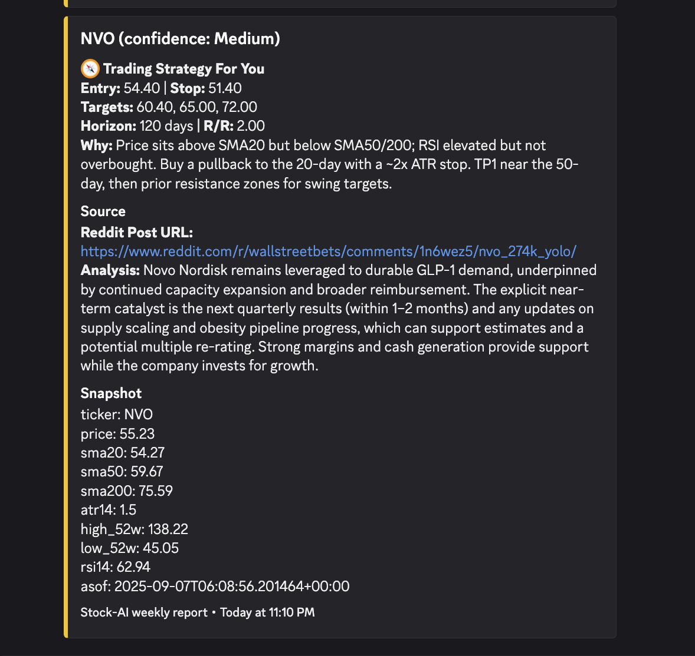
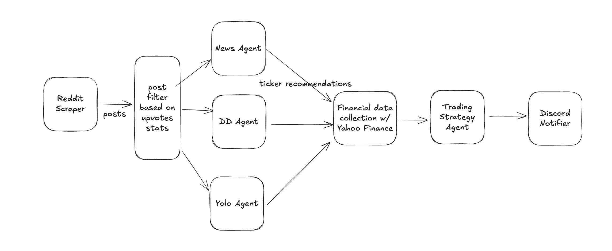

# Reddit-Posts-Stock-AI-Recommendation-System

An AI-powered stock analysis and recommendation system that scrapes Reddit's `r/wallstreetbets`, analyzes posts using AI agents, and generates trading recommendations with technical analysis.

A cron job is set up to run the workflow and send results to Discord every week. Please be aware - the recommendation is **NOT** a financial advice, use it at your own risk.

I am also hoping the workflow engine and AI agent framework can be adapted for other use cases in the future.

## Join the Discord Channel
If you want to receive the stock recommendations directly, please join my Discord: [https://discord.gg/XxP8z5dxFX](https://discord.gg/XxP8z5dxFX)

It's now still under testing and development, but you can see the recommendations in the `#stock-recommendations` channel.

Feel free to share your feedbacks and suggestions!

## Overview

Reddit-Posts-Stock-AI-Recommendation-System combines social media sentiment analysis with technical indicators to provide stock recommendations. It scrapes Reddit posts from `r/wallstreetbets`, processes them through specialized AI agents, fetches real-time market data, and generates comprehensive trading plans with entry/exit points and risk management strategies.

## Features

- **Multi-Agent Analysis**: Three specialized AI agents analyze different types of Reddit posts:
  - **News Agent**: Extracts stock mentions and sentiment from news posts
  - **DD Agent**: Provides high-conviction buy ideas from due diligence posts  
  - **YOLO Agent**: Identifies speculative, high-risk/reward opportunities from YOLO posts

- **Technical Analysis**: Integrates Yahoo Finance data including:
  - Price and volume data
  - Moving averages (SMA20, SMA50, SMA200)
  - Technical indicators (RSI, ATR)
  - 52-week highs and lows

- **Portfolio Planning**: AI-driven portfolio planner generates:
  - Entry and exit points
  - Stop-loss levels
  - Take-profit targets
  - Risk/reward ratios
  - Time horizons

- **Discord Integration**: Automatically sends formatted recommendations to Discord channels

Example Discord Output:


## Architecture



### Core Components

- **Reddit Scraper** (`stock_ai/reddit/`): Fetches posts from `r/wallstreetbets` using `PRAW`
- **Yahoo Finance Client** (`stock_ai/yahoo_finance/`): Retrieves real-time market data
- **AI Agents** (`stock_ai/agents/`): Specialized LLM agents for different analysis types
  - Currently has hard dependency on OpenAI's GPT-5 model and Response API
- **Workflow Engine** (`stock_ai/workflows/`): Orchestrates the entire analysis pipeline
  - A generic, extensible workflow engine that can be adapted for other use cases
  - Supports parallel execution of agents and data fetching
  - Modular design for easy addition of new agents or data sources
- **Discord Notifier** (`stock_ai/notifiers/`): Sends formatted results to Discord
  - Will be extended to support other notification channels in the future, such as email

### Workflow Pipeline

1. **Data Collection**: Scrape recent posts from r/wallstreetbets (News, DD, YOLO flairs)
2. **Post Filtering**: Filter posts by engagement metrics and content quality
3. **AI Analysis**: Run specialized agents on filtered posts by category
4. **Data Merging**: Consolidate recommendations and remove duplicates
5. **Market Data**: Fetch technical indicators for recommended tickers
6. **Portfolio Planning**: Generate trading strategies with risk management
7. **Output Generation**: Compile final recommendations with all analysis
8. **Discord Notification**: Send formatted results to Discord channel


## Roadmap
- [ ] Develop evaluation framework to measure performance of recommendations over time
- [ ] Integrate email notification channel so it becomes a newsletter system


## How to

### Database migration
Uses Alembic for database migrations. To create a new migration after modifying the models, run:
```bash
uv run alembic revision --autogenerate -m "your message"
```
Make sure your `.env` file has `DATABASE_URL_REMOTE` set to your remote database URL. (For me, it's a Supabase Postgres database)

Then apply the migration with:
```bash
DB_TARGET=REMOTE uv run alembic upgrade head
```