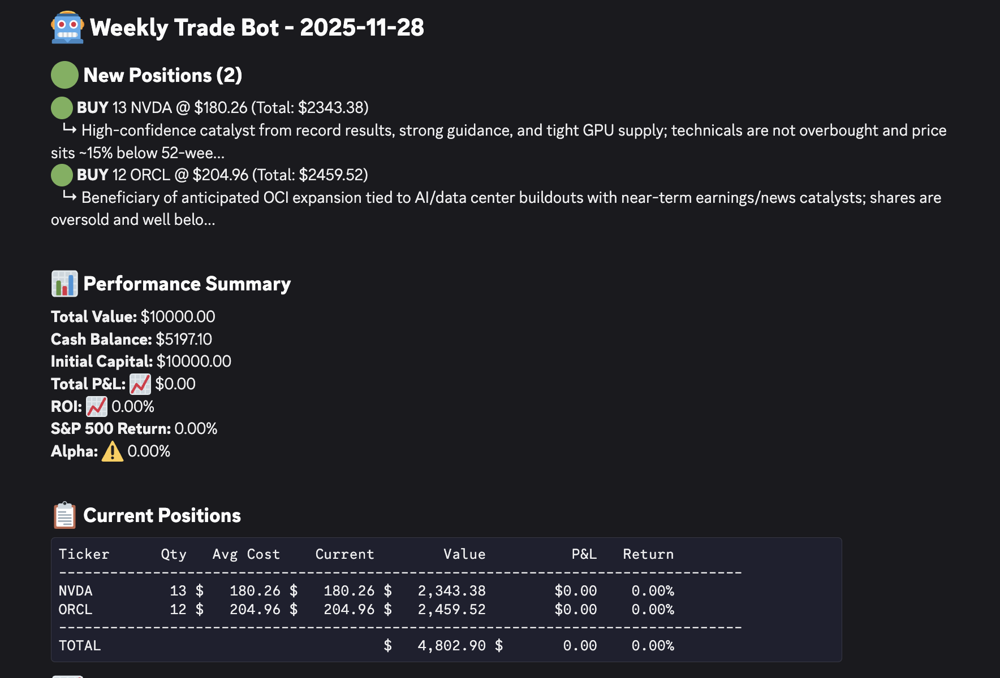
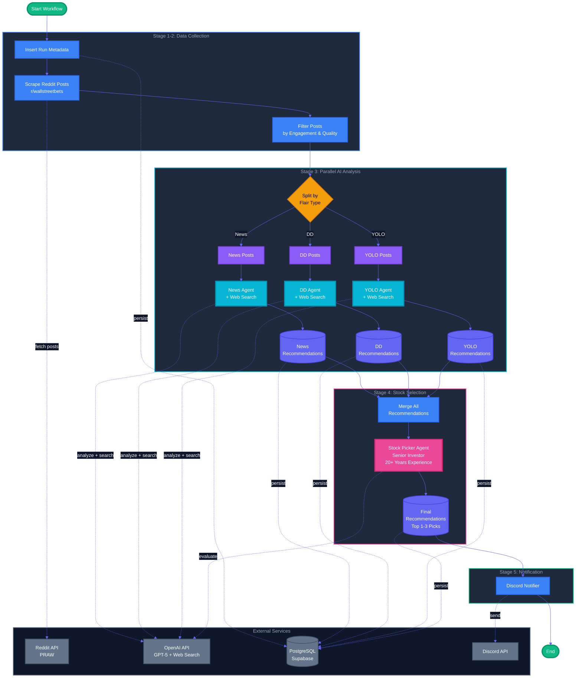

# Reddit-Posts-Stock-AI-Recommendation-System

An AI-powered stock analysis and recommendation system that:
- Scrapes Reddit's `r/wallstreetbets`, analyzes posts using AI agents, and generates a list of stock BUY recommendations.
- Based on the recommendations, a trader AI agent make decisions on which stocks to buy/sell for a virtual portfolio.
- A daily cron job that tracks the portfolio performance


Please be aware - the recommendation is **NOT** a financial advice, use it at your own risk.

I am also hoping the workflow engine and AI agent framework can be adapted for other use cases in the future.

## Join the Discord Channel
If you want to receive the stock recommendations directly, please join my Discord: [https://discord.gg/XxP8z5dxFX](https://discord.gg/XxP8z5dxFX)

You can see the recommendations and the daily performance updates of the virtual portfolio in the `#stock-recommendations` channel.

Feel free to share your feedbacks and suggestions!

## Overview

The system runs on three github workflows:
1. **Reddit Stock Recommendation Workflow**: Runs weekly to scrape Reddit posts, analyze them with AI agents, generate stock BUY recommendations, and send them to Discord
2. **Weekly Trade Workflow**: Runs weekly to make buy/sell/hold decisions based on the latest recommendations and update the virtual portfolio, then send the trade summary to Discord
3. **Daily Performance Workflow**: Runs daily to track the portfolio performance and send updates to Discord

## Features

- **Multi-Agent Analysis with Web Search**: Three specialized AI agents analyze different types of Reddit posts and verify findings through real-time web research:
  - **News Agent**: Extracts stock mentions from news posts and performs web searches to verify recent catalysts, earnings, and market developments
  - **DD Agent**: Analyzes due diligence posts and cross-references claims with current market data, filings, and news sources
  - **YOLO Agent**: Identifies high-risk/reward opportunities from YOLO posts and validates momentum through real-time web searches

- **Stock Picker Agent**: A senior institutional investor AI agent that:
  - Reviews all recommendations from the three specialized agents
  - Evaluates investment thesis strength, risk profiles, and market timing
  - Applies 20+ years of market experience to identify patterns
  - Selects the top 1-3 highest-conviction picks
  - Provides rationale for final selections

- **Trading Decision AI Agent**:
  - Reviews the latest stock recommendations, current portfolio holdings and current market prices
  - Makes buy/sell/hold decisions based on recommendation confidence levels and portfolio diversification
  - Generates a trade summary with reasoning for each action
  - Updates the virtual portfolio based on trades executed
  - Caveat: Trades are simulated using current prices from the Yahoo Finance API and may not reflect actual broker execution prices

- **Memory Persistence**: Uses PostgreSQL (via Supabase) to store workflow state, Reddit posts, agent analyses, recommendations, portfolio data, trades, and performance metrics, etc.
  - Enables tracking of recommendation performance over time
  - Facilitates idempotent workflow execution

- **Workflow Engine**: A modular and extensible workflow engine that orchestrates the entire analysis pipeline
  - Supports parallel execution of AI agents
  - Idempotent step processing with SQL-based persistence
  - Easy to add new agents or data sources in the future


- **Discord Integration**: Automatically sends recommendations, trade summaries, and portfolio performance updates to Discord channels

Example Discord Output:





## Tech Stack
Python, PRAW (Reddit API), OpenAI GPT-5 with Web Search, Yahoo Finance API, PostgreSQL (Supabase), Discord API, Alembic (DB migrations), GitHub Actions

(I roll my own workflow engine and AI agent framework!)

## Architecture



## Roadmap
- [X] Develop evaluation framework to measure performance of recommendations over time
- Any suggestions are welcome!

## How to

### Database migration
Uses Alembic for database migrations. To create a new migration after modifying the models, run:
```bash
uv run alembic revision --autogenerate -m "your message"
```
Make sure your `.env` file has `DATABASE_URL_REMOTE` set to your remote database URL. (For me, it's a Supabase Postgres database)

Then apply the migration with:
```bash
DB_TARGET=REMOTE uv run alembic upgrade head
```