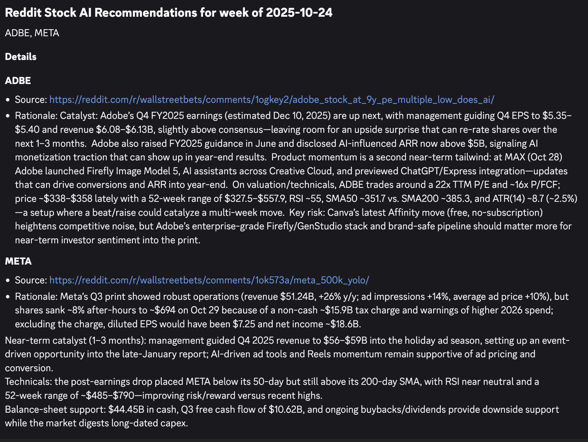

# Reddit-Posts-Stock-AI-Recommendation-System

An AI-powered stock analysis and recommendation system that scrapes Reddit's `r/wallstreetbets`, analyzes posts using AI agents, and generates a list of stock BUY recommendations.

A cron job is set up to run the workflow and send results to Discord every week. Please be aware - the recommendation is **NOT** a financial advice, use it at your own risk.

I am also hoping the workflow engine and AI agent framework can be adapted for other use cases in the future.

## Join the Discord Channel
If you want to receive the stock recommendations directly, please join my Discord: [https://discord.gg/XxP8z5dxFX](https://discord.gg/XxP8z5dxFX)

It's now still under testing and development, but you can see the recommendations in the `#stock-recommendations` channel.

Feel free to share your feedbacks and suggestions!

## Overview

Reddit-Posts-Stock-AI-Recommendation-System combines social media sentiment analysis with real-time web research to provide curated stock recommendations. It scrapes Reddit posts from `r/wallstreetbets`, processes them through specialized AI agents with web search capabilities, and uses a senior picker agent to select the highest-conviction opportunities from the pool of recommendations.

## Features

- **Multi-Agent Analysis with Web Search**: Three specialized AI agents analyze different types of Reddit posts and verify findings through real-time web research:
  - **News Agent**: Extracts stock mentions from news posts and performs web searches to verify recent catalysts, earnings, and market developments
  - **DD Agent**: Analyzes due diligence posts and cross-references claims with current market data, filings, and news sources
  - **YOLO Agent**: Identifies high-risk/reward opportunities from YOLO posts and validates momentum through real-time web searches

- **Stock Picker Agent**: A senior institutional investor AI agent that:
  - Reviews all recommendations from the three specialized agents
  - Evaluates investment thesis strength, risk profiles, and market timing
  - Applies 20+ years of market experience to identify patterns
  - Selects the top 1-3 highest-conviction picks
  - Provides rationale for final selections

- **Real-Time Intelligence**: Each agent leverages OpenAI's web search tool to:
  - Verify recent catalysts and earnings news
  - Cross-check Reddit claims with authoritative sources
  - Gather diverse perspectives from multiple web sources
  - Ensure recommendations are grounded in current market reality

- **Discord Integration**: Automatically sends formatted recommendations to Discord channels

Example Discord Output:


## Architecture


### Core Components

- **Reddit Scraper** (`stock_ai/reddit/`): Fetches posts from `r/wallstreetbets` using `PRAW`
- **AI Agents** (`stock_ai/agents/`): Specialized LLM agents with web search capabilities
  - **Reddit Agents**: News, DD, and YOLO agents that analyze posts and perform web research
  - **Stock Picker Agent**: Senior investor agent that selects top picks from all recommendations
  - Currently has hard dependency on OpenAI's GPT-5 model and Response API with web search tool
- **Workflow Engine** (`stock_ai/workflows/`): Orchestrates the entire analysis pipeline
  - A generic, extensible workflow engine that can be adapted for other use cases
  - Supports parallel execution of agents and idempotent step processing
  - Modular design for easy addition of new agents or data sources
  - SQL-based persistence layer for tracking workflow state
- **Discord Notifier** (`stock_ai/notifiers/`): Sends formatted results to Discord
  - Will be extended to support other notification channels in the future, such as email

### Workflow Pipeline

1. **Data Collection**: Scrape recent posts from r/wallstreetbets (News, DD, YOLO flairs)
2. **Post Filtering**: Filter posts by engagement metrics and content quality
3. **AI Analysis with Web Research**: Run specialized agents in parallel on filtered posts
   - Each agent analyzes posts in their category (News/DD/YOLO)
   - Agents perform real-time web searches to verify claims and gather market intelligence
   - Generate initial BUY recommendations with confidence levels
4. **Stock Selection**: Stock Picker agent evaluates all recommendations
   - Reviews investment thesis quality and risk profiles
   - Applies institutional investor criteria to select top 1-3 picks
   - Provides rationale for final selections
5. **Discord Notification**: Send curated recommendations to Discord channel


## Roadmap
- [ ] Develop evaluation framework to measure performance of recommendations over time
- [ ] Integrate email notification channel so it becomes a newsletter system


## How to

### Database migration
Uses Alembic for database migrations. To create a new migration after modifying the models, run:
```bash
uv run alembic revision --autogenerate -m "your message"
```
Make sure your `.env` file has `DATABASE_URL_REMOTE` set to your remote database URL. (For me, it's a Supabase Postgres database)

Then apply the migration with:
```bash
DB_TARGET=REMOTE uv run alembic upgrade head
```